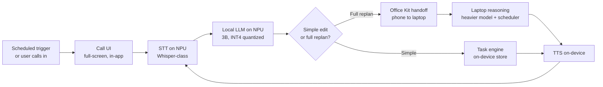

# RingList — Project Context

**iQOO Hackathon 2026 · Productivity track · Hyderabad city battle (Sept 26–27)**

> Your to-do list stops waiting to be opened, and calls you instead.

This document covers the idea, the architecture, and the impact. For setup and code
layout, see [README.md](README.md).

---

## 1. The problem

Most people set up a to-do list once, then stop opening it.

The information is all there. The habit of checking it dies within days. And the standard
fix — push notifications — has been eroded into background noise: they arrive in the same
tray as a food-delivery promo, get swiped away unread, and cost nothing to ignore.

The bottleneck is not **organising** tasks. Every list app has solved that. The bottleneck
is getting the list **looked at and acted on**.

Every existing product competes on being a better place to put information. That is the
wrong axis. The list is already good enough; the retrieval habit is what's broken.

## 2. The solution

**Invert the interface. The assistant initiates contact — the way a phone call does.**

A phone call is the one notification pattern humans have not learned to ignore. It takes
over the screen, it makes noise, it demands a decision now. RingList borrows that
affordance for your own tasks.

At a scheduled moment — or whenever the user calls in — the phone shows a full-screen
incoming call. Caller ID reads **"Your Tasks."** The user answers and has a short spoken
conversation about their day: what's due, what to move, what to add, what actually matters
right now. The tasks update during the call. No app is ever opened.

```
8:30 AM   ▸ phone rings — caller ID: "Your Tasks"
          ▸ user answers
   AI     ▸ "You've got 3 things today. The client deck is due by 2,
             and yesterday's follow-up is still open. Want to go through them?"
  USER    ▸ "Push the deck to tomorrow, I need the morning for the follow-up."
   AI     ▸ "Done — deck moves to tomorrow at 9. That frees your morning."
  USER    ▸ "Replan my afternoon."
   AI     ▸ [hands off to laptop] "Follow-up first at 4:30, then the deck
             splits around your design review. Heads up — it runs ten
             minutes past deadline. Want me to cut the expense report?"
          ▸ call ends. Tasks are updated.
```

The user can also call **in** — "help me plan today" — and reason out loud to build the
list from scratch.

### Why this wins on the axis that matters

| | Typical to-do app | RingList |
|---|---|---|
| Who starts | User must remember | **The list starts it** |
| Interface | Screen, tapping | Voice, hands-free |
| Cost to ignore | One swipe | A call you actively declined |
| Where the data lives | Vendor cloud | **On the device** |

---

## 3. Architecture

### 3.1 Target architecture — fully on-device

The product runs its entire voice loop **locally on the Snapdragon NPU**. Nothing about
your day leaves the phone. The laptop is used only for heavy replanning, and only over
the user's own local link.



**The four pieces:**

1. **Call UI** — a full-screen view that looks and sounds like a native incoming call:
   ringtone, caller name, slide-to-answer. Built in-app, *not* a real telephone call.
2. **Voice loop** — turn-based. Tap to talk, release, the assistant replies. On-device
   STT → local LLM → on-device TTS.
3. **Task engine** — a structured local store (title, deadline, duration, priority,
   status) that the voice loop reads and writes directly for simple edits.
4. **Office Kit routing** — when the ask exceeds a single edit ("replan my whole week"),
   the phone hands task data to the laptop, a heavier model recomputes an optimised plan,
   and the result returns into the next call turn.

### 3.2 The on-device NPU path

The Snapdragon platform in iQOO flagships (8 Elite / 8 Gen 3 class) carries a **Hexagon
NPU** that runs quantized transformer inference at a fraction of the power and latency of
the CPU or GPU — and without a network round trip.

| Stage | Model | Runtime | Notes |
|---|---|---|---|
| **STT** | Whisper-Base/Small (EN) | Qualcomm AI Hub → QNN | Pre-optimized builds published for Snapdragon |
| **Dialogue LLM** | Llama 3.2 3B Instruct or Qwen 2.5 3B, **INT4** | Genie / QAIRT GenAI extensions | 3B INT4 fits comfortably in flagship RAM |
| **Task engine** | — | Kotlin + Room/SQLite | Deterministic. No model involved |
| **TTS** | Android `TextToSpeech`, or Piper/Sherpa-ONNX | System API / ONNX Runtime | System TTS is already on-device |
| **Handoff** | — | vivo/iQOO **Office Kit** | Phone ↔ laptop, over the user's own link |

**Why the NPU specifically, not just "a small model":**

- **Latency.** No network hop. A cloud round trip on conference-centre Wi-Fi is the single
  most likely thing to break a live demo — and the single most likely thing to make the
  product feel bad in daily use.
- **Power.** The NPU is built for sustained quantized inference. Running this on the CPU
  would cook the battery on a feature you're meant to use every morning.
- **Privacy.** Your to-do list is a map of your life: who you owe work to, when you're
  free, what you're behind on. That is exactly the data that should never be uploaded.
  On-device is not a footnote here — it's a core claim.
- **Works offline.** The 8:30 AM call happens on the metro, in a basement, on a plane.

> **Status:** the NPU numbers are engineering targets to validate on real hardware, not
> measured results. Spiking STT→LLM→TTS on a physical device *before* the build window
> is the highest-value de-risking task (see §6).

### 3.3 Round-1 demo architecture — what's built right now

Round 1 has to be shown on a laptop, before the Android build exists. So the demo is a web
app with a mobile-shaped call UI, and **Groq stands in for the NPU** — same pipeline shape,
same routing decision, same deterministic engine, just a different inference backend.

```
hold mic ──▶ Whisper ──▶ Dialogue agent ──▶ Task engine ──▶ speak reply
             (STT)       (small model)      (deterministic)
                              │
                              │ request_replan  ← only for whole-day restructuring
                              ▼
                         Planner agent ──▶ EDF scheduler ──▶ narrated back
                         (heavy model)      (no model)
```

**The substitution is one layer deep and deliberately reversible:**

| Target (on-device) | Demo (today) | Swapped by changing |
|---|---|---|
| Whisper on Hexagon NPU | `whisper-large-v3-turbo` via Groq | `lib/groq.ts` |
| Llama 3.2 3B INT4 on NPU | `gpt-oss-20b` via Groq | `MODELS.dialogue` |
| Laptop model over Office Kit | `gpt-oss-120b` via Groq | `MODELS.planner` |
| Room/SQLite task store | In-memory + client state | `lib/taskEngine.ts` |
| Android TTS | Groq Orpheus → browser speech | `lib/audio.ts` |

Every model id is environment-overridable, so retargeting to a local runtime is a config
change plus one adapter — not a rewrite. The **task engine, the scheduler, the tool
contract, and the routing logic are all backend-independent** and carry over as-is.

**Measured on the current build:**

| Stage | Latency |
|---|---|
| STT (Whisper turbo) | ~350 ms |
| Opening briefing | ~420 ms |
| Simple edit turn (end to end) | ~870 ms – 1.4 s |
| Full replan turn (incl. handoff) | ~1.7 – 2.4 s |

---

## 4. The planning algorithm

This is the part that separates the project from an LLM wrapper.

"Optimal to-do list" is a phrase that means nothing unless a real method sits behind it.
An LLM asked to "plan my day" produces plausible-sounding text that falls apart the moment
a judge checks whether the times actually work. So **the schedule is computed, not
generated** — `buildPlan()` in [`lib/agents/scheduler.ts`](lib/agents/scheduler.ts) runs
no model at all:

1. **Free slots** = working window minus fixed calendar blocks.
2. **Earliest-deadline-first ordering.** EDF is provably optimal for feasibility on a
   single resource: if *any* ordering meets every deadline, EDF does. Priority breaks
   ties, then shortest-duration-first so quick wins aren't stuck behind long blocks.
3. **Greedy time-boxing** into the earliest capacity, splitting a task across gaps when
   it's longer than the slot it lands in (minimum 15-minute chunks — no slivers).
4. **Slack check.** Anything finishing after its deadline is reported as a conflict with
   the exact shortfall in minutes — never silently moved, never quietly dropped.

The heavy model is explicitly forbidden from reordering the result. It only reads it back
in natural speech. The UI prints the scheduler's own trace next to the timeline, so the
claim is inspectable rather than asserted:

```
Window 4:04 PM to 9:00 PM · 5 open task(s) · 2 fixed block(s)
Free capacity: 238 min across 3 gap(s)
Demand: 175 min. Fits inside the window.
EDF order: Priya follow-up -> Client deck -> Standup notes -> Gym -> Expenses
OK  "Reply to Priya's follow-up" -> 4:04 PM (20 min)
!   "Client deck" lands past deadline by 10 min.
Booked 175/238 min (74% utilization), 1 conflict(s).
```

**The same separation runs through the whole system:** models decide *intent*, code decides
*state*. The dialogue agent cannot touch the task list except through a fixed tool
contract, so anything the assistant claims on the call is something that provably happened.

---

## 5. Tech stack

**Demo (built):** Next.js 15 · React 19 · TypeScript (strict) · Tailwind · Zustand ·
Groq (Whisper + gpt-oss 20B/120B) · Web Audio API · MediaRecorder

**Target (Android):** Kotlin · Jetpack Compose · Room/SQLite · Qualcomm AI Hub + QAIRT/QNN ·
Genie GenAI extensions · Android TextToSpeech · `AlarmManager`/`WorkManager` for the
scheduled ring · full-screen intent notification for the call UI · vivo Office Kit

### Scope decisions — what we are deliberately *not* building

- **No real phone call.** Not placing an actual telecom/VoIP call. Android restricts live
  call-audio access heavily post-Android 10, and a real call adds an external dependency
  (Twilio et al.) for zero audience-visible benefit. The in-app simulated call looks
  identical from the outside and skips an entire category of platform risk.
- **No full-duplex conversation.** No barge-in, no overlapping speech. The loop is
  turn-based: tap to talk, release, wait for the reply. Far more achievable in ~19 hours,
  and it means a noisy room can never talk over the assistant mid-pitch.
- **No free-form LLM planning.** See §4.

---

## 6. Impact

### For the user

- **The habit problem is actually solved**, not restated. A call gets answered; a
  notification gets swiped. That is the entire thesis and it's testable.
- **Hands-free at the moment it matters** — commuting, cooking, walking between meetings.
  Exactly when you think about your day and can't tap a screen.
- **Accessibility.** A voice-first task manager is usable by people for whom a dense
  touch UI isn't: low vision, motor impairment, or just low literacy in the app's language.
- **Privacy as a default, not a setting.** On-device means your commitments, your
  colleagues' names, and your calendar gaps never reach anyone's server.

### For the platform (why this belongs on an iQOO phone)

It uses the NPU for something a user would genuinely notice, every single morning —
rather than as a spec-sheet bullet. It's a daily-active, habitual use of on-device AI,
and it degrades gracefully to *nothing* without the hardware: cloud voice assistants are
slow, metered, and privacy-hostile by comparison. The Office Kit handoff is likewise a
real capability with a real reason to exist here, not a decorative integration.

### Rubric alignment

| Criterion | Weight | How this scores |
|---|---|---|
| End product quality (jury) | 30% | Turn-based scope keeps the core loop reliable and demoable end to end |
| Novelty and impact (jury) | 20% | "The list calls you" is an uncommon interface pattern vs. typical to-do/notification apps |
| Creative phone use (HackTracker) | 15% | Full closed-loop on-device voice interaction: STT + reasoning + TTS |
| Technical depth (jury) | 15% | Structured task engine + EDF scheduler + on-device/laptop routing — not an LLM wrapper |
| Office Kit usage (HackTracker) | 10% | Genuine handoff for heavy replanning, not decorative |
| Demo and presentation (jury) | 10% | A phone visibly ringing and holding a spoken conversation is a strong live moment |

### Risks and mitigations

| Risk | Mitigation |
|---|---|
| Voice loop latency feels unnatural | Turn-based, not full-duplex; round-trip measured on Day 1 |
| NPU pipeline unfamiliar to team | **Spike STT→LLM→TTS on a personal Android phone *before* the event** — not for the first time during the 19-hour build |
| Live mic fails on stage | Type-input fallback and click-to-send prompts run the identical pipeline; pre-recorded run kept ready |
| "Optimal" replanning reads as vague LLM text | Grounded in a stated algorithm with a visible trace (§4) |
| Office Kit handoff cut under time pressure | Scoped as an Hr 8–14 checkpoint, not a stretch goal |
| Rate limits / network on demo day | Already hit and handled in the web build: backoff on the provider's own retry delay. On-device, the problem disappears entirely |

---

## 7. Demo script (3–5 min)

1. **Problem in one line.** "Everyone has a to-do list they stopped opening."
2. **Trigger the call live.** Phone rings, "Your Tasks" on screen. Let it ring a beat —
   this is the moment the room understands the idea.
3. **Short real exchange.** Reschedule one task, mark one done. Point at the board
   updating mid-sentence.
4. **Ask for a full replan out loud.** "Replan my afternoon." Show the handoff happening
   and the scheduler trace — *this* is the technical-depth beat.
5. **Close on differentiation.** On-device, private, offline-capable, and an interface
   built to actually get used — not just another list.
